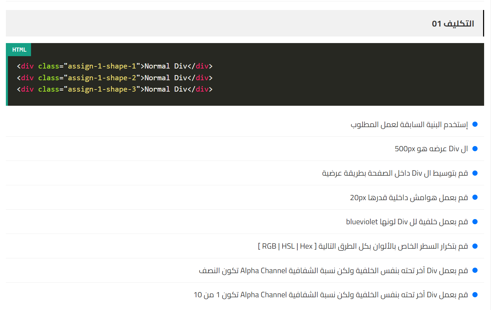
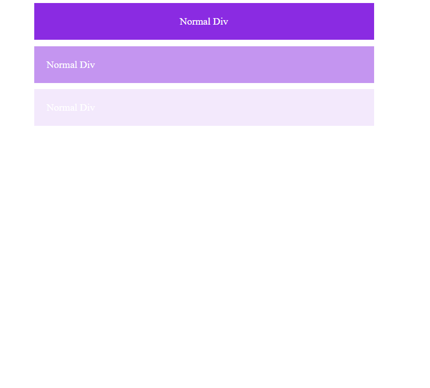

# Assignment Explanation



## HTML Code

```html
<!DOCTYPE html>
<html lang="en">
<head>
    <meta charset="UTF-8">
    <meta name="viewport" content="width=device-width, initial-scale=1.0">
    <title>Document</title>
    <link rel="stylesheet" href="style.css">
</head>
<body>
    <div class="assign-1-shape-1">Normal Div</div>
    <div class="assign-1-shape-2">Normal Div</div>
    <div class="assign-1-shape-3">Normal Div</div>
</body>
</html>
```

## CSS Code

```css
.assign-1-shape-1 {
    width: 500px;                   /* Set the width of the div */
    margin: 0 auto;                 /* Center the div horizontally */
    margin-bottom: 10px;            /* Add a bottom margin */
    text-align: center;             /* Center the text inside the div */
    padding: 20px;                  /* Add padding inside the div */
    background-color: blueviolet;   /* Set the background color */
    color: white;                   /* Set the text color */
}

.assign-1-shape-2 {
    width: 500px;                   /* Set the width of the div */
    margin: 0 auto;                 /* Center the div horizontally */
    margin-bottom: 10px;            /* Add a bottom margin */
    padding: 20px;                  /* Add padding inside the div */
    background-color: rgba(138, 43, 226, 0.5);  /* Background color with 50% opacity */
    color: white;                   /* Set the text color */
}

.assign-1-shape-3 {
    width: 500px;                   /* Set the width of the div */
    margin: 0 auto;                 /* Center the div horizontally */
    margin-bottom: 10px;            /* Add a bottom margin */
    padding: 20px;                  /* Add padding inside the div */
    background-color: rgba(138, 43, 226, 0.1);  /* Background color with 10% opacity */
    color: white;                   /* Set the text color */
}
```

## Webpage Preview

**Preview of the Webpage**


