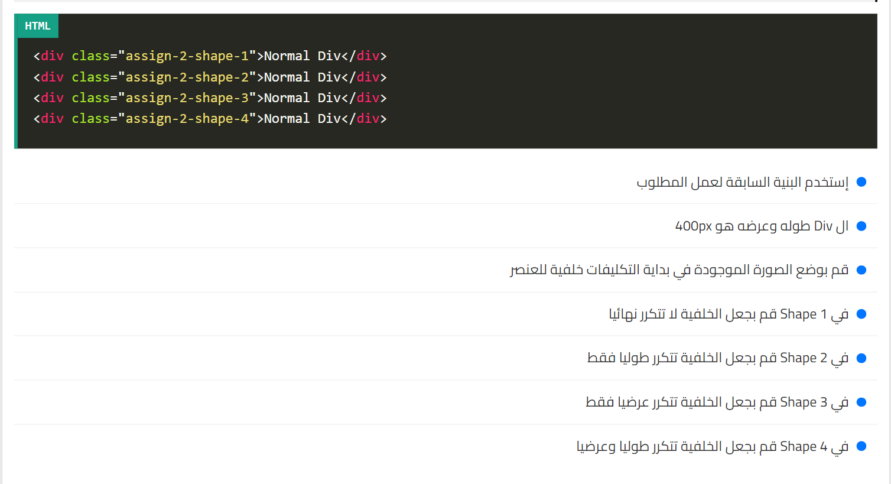

# Assignment Explanation



## HTML Code

```html
<!DOCTYPE html>
<html lang="en">
<head>
    <meta charset="UTF-8">
    <meta name="viewport" content="width=device-width, initial-scale=1.0">
    <title>Document</title>
    <link rel="stylesheet" href="style.css">
</head>
<body>
    <div class="assign-1-shape-1">Normal Div</div>
    <div class="assign-1-shape-2">Normal Div</div>
    <div class="assign-1-shape-3">Normal Div</div>
    <div class="assign-1-shape-4">Normal Div</div>
</body>
</html>
```

## CSS Code

```css
.assign-1-shape-1 {
    width: 400px;                   /* Width of the div */
    height: 400px;                  /* Height of the div */
    background-image: url(./testPhoto.png);  /* Background image */
    background-repeat: no-repeat;   /* No repeat */
}

.assign-1-shape-2 {
    width: 400px;                   /* Width of the div */
    height: 400px;                  /* Height of the div */
    background-image: url(./testPhoto.png);  /* Background image */
    background-repeat:repeat-x   /* No repeat */
}

.assign-1-shape-3 {
    width: 400px;                   /* Width of the div */
    height: 400px;                  /* Height of the div */
    background-image: url(./testPhoto.png);  /* Background image */
    background-repeat:repeat-y;
}

.assign-1-shape-4 {
    width: 400px;                   /* Width of the div */
    height: 400px;                  /* Height of the div */
    background-image: url(./testPhoto.png);  /* Background image */
    background-repeat:repeat;
}
```

## Webpage Preview

**Preview of the Webpage**

